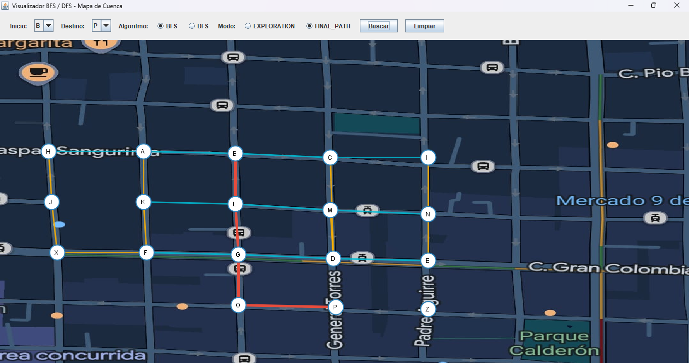
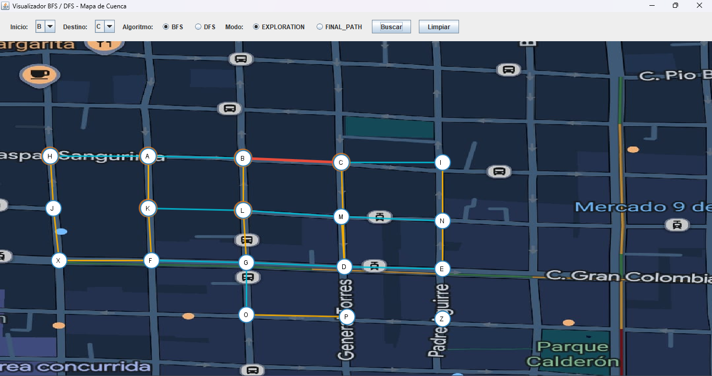

# INFORME – PROYECTO FINAL DE ESTRUCTURA DE DATOS

## 1. CARÁTULA

* Universidad Politecnica Salesiana
* Carrera: Computación
* Asignatura: Estructura de Datos
* Integrantes: Jorge Luis Padilla | Eythan Solano
* Correos institucionales:
jpadillam8@est.ups.edu.ec - esolanos4@est.ups.edu.ec
* Docente: Pablo Torres
* Grupo: 3
* Fecha: 29/07/2026

---

## 2. ÍNDICE

1. Objetivos
2. Descripción del problema
3. Marco teórico
4. Tecnologías utilizadas
5. Diseño y arquitectura
6. Diagrama UML
7. Funcionamiento de la aplicación
8. Configuraciones del mapa
9. Ejemplo comentado de BFS
10. Comparación BFS vs DFS
11. Conclusiones
12. Recomendaciones

---

## 3. OBJETIVOS

### 3.1 Objetivo general

Desarrollar una aplicación en Java que represente un mapa de calles mediante un grafo y permita encontrar y visualizar rutas utilizando los algoritmos BFS y DFS.

### 3.2 Objetivos específicos

* Representar las intersecciones del mapa mediante nodos
* Representar las calles mediante aristas.
* Implementar un grafo genérico.
* Implementar BFS y DFS.
* Registrar los nodos visitados durante la búsqueda.
* Reconstruir la ruta encontrada.
* Visualizar gráficamente la exploración y la ruta final.
* Implementar persistencia para guardar y cargar el grafo.
* Comparar el comportamiento de BFS y DFS.

---

# 4. DESCRIPCIÓN DEL PROBLEMA

El proyecto consiste en desarrollar una aplicación capaz de representar un mapa de calles utilizando un grafo.

Las intersecciones del mapa se representan como vértices y las calles como aristas. Cada punto contiene un identificador y sus coordenadas sobre la imagen del mapa.

El usuario debe poder seleccionar un punto de inicio y un punto de destino y posteriormente seleccionar uno de los algoritmos de búsqueda:

* BFS.
* DFS.

La aplicación debe mostrar el proceso de exploración y la ruta encontrada.

Además, debe permitir guardar y cargar la configuración del mapa.

---

# 5. MARCO TEÓRICO

## 5.1 Grafos

Un grafo es una estructura formada por vértices y aristas. En este proyecto los vértices representan intersecciones y las aristas representan las conexiones entre ellas.

## 5.2 BFS

BFS significa Breadth-First Search. Es un algoritmo que recorre el grafo por niveles y utiliza una cola para controlar los nodos pendientes de visitar.

En grafos no ponderados, BFS permite encontrar una ruta con la menor cantidad de aristas.

## 5.3 DFS

DFS significa Depth-First Search. Es un algoritmo que explora una rama del grafo hasta donde sea posible antes de retroceder y continuar con otra rama.

Puede implementarse mediante recursividad o mediante una pila.

## 5.4 Comparación BFS y DFS

BFS explora por niveles, mientras que DFS explora en profundidad. Debido a esta diferencia, ambos algoritmos pueden visitar los nodos en diferente orden y encontrar diferentes rutas.

---

# 6. TECNOLOGÍAS UTILIZADAS

* Java.
* Java Swing.
* Estructuras genéricas.
* `Map`.
* `Set`.
* `Queue`.
* Git.
* GitHub.

---

# 7. DISEÑO Y ARQUITECTURA

El proyecto utiliza una arquitectura basada en MVC.

### Modelo

Contiene:

* `MapPoint`
* `Node`
* `Graph`
* `PathResult`
* `PathFinder`
* `BFSPathFinder`
* `DFSPathFinder`

### Vista

Contiene la interfaz gráfica, el mapa, los nodos, las conexiones y la visualización de los recorridos.

### Controlador

`GraphController` comunica la interfaz gráfica con el grafo y los algoritmos de búsqueda.

---

# 8. DIAGRAMA UML

Incluir el diagrama UML de las clases principales:

```text
MapPoint
    ↓
Node<T>
    ↓
Graph<T>
    ↓
PathFinder<T>
   ↙       ↘
BFS       DFS
   ↘       ↙
   PathResult<T>

GraphController
       ↓
      View
```

El diagrama debe mostrar las relaciones entre las clases, atributos principales, métodos principales, herencia e implementación de interfaces.

---

# 9. FUNCIONAMIENTO DE LA APLICACIÓN

La aplicación funciona de la siguiente manera:

1. Se carga la imagen del mapa.
2. Se cargan los puntos y conexiones.
3. El usuario selecciona un punto inicial.
4. El usuario selecciona un punto destino.
5. Selecciona BFS o DFS.
6. Selecciona el modo de visualización.
7. Se ejecuta el algoritmo.
8. Se registra el orden de los nodos visitados.
9. Se reconstruye la ruta.
10. Se muestra el resultado en el mapa.

La aplicación cuenta con dos modos:

### EXPLORATION

Muestra progresivamente los nodos visitados y posteriormente resalta la ruta encontrada.

### FINAL_PATH

Muestra únicamente la ruta final encontrada.

---

# 10. CONFIGURACIONES DEL MAPA

## Configuración 1

**Descripción:** Hicimos un recorrido de b hasta p y podemos ver que a diferencia de puntos mas cercanos este se demora un poco mas.

**Captura del mapa:**



**Punto inicial:** [b]

**Punto destino:** [p]

**Conexiones principales:** [B,L,G,Q,P]

---

## Configuración 2

**Descripción:** En este el cual recorre el punto B al C, podemos ver como no se demora tanto, ya que hace menos recorridos.

**Captura del mapa:**



**Punto inicial:** [B]

**Punto destino:** [C]

**Conexiones principales:** [B,C]

---

# 11. EJEMPLO COMENTADO DE BFS

Para demostrar el funcionamiento de BFS se utiliza el siguiente ejemplo:

```text
        B
       / \
      A   D
       \ /
        C
```

Inicio:

```text
A
```

Destino:

```text
D
```

### Paso 1

BFS comienza en `A`.

```text
Visitados: A
Cola: A
```

### Paso 2

Se visitan los vecinos de `A`.

```text
Visitados: A, B, C
Cola: B, C
```

Se registran los predecesores:

```text
B ← A
C ← A
```

### Paso 3

Se procesa `B` y se encuentra `D`.

```text
D ← B
```

### Paso 4

Se reconstruye la ruta desde el destino:

```text
D ← B ← A
```

Resultado:

```text
A → B → D
```

En la implementación real se debe incluir una captura de la ejecución de BFS en el mapa.

---

# 12. COMPARACIÓN BFS VS DFS

La comparación debe realizarse utilizando las mismas configuraciones del mapa.

| Caso | Algoritmo | Inicio | Destino | Nodos visitados | Aristas en la ruta | Tiempo (ms) |
|---|---|---|---|---|---|---|
| 1 (ruta directa) | BFS | H | A | 3 | 1 | 3.1778 |
| 1 (ruta directa) | DFS | H | A | 2 | 1 | 0.0888 |
| 2 (varias rutas posibles) | BFS | A | D | 14 | 3 | 0.1469 |
| 2 (varias rutas posibles) | DFS | A | D | 11 | 10 | 0.0695 |
| 3 (sin conexión) | BFS | A | Z | 17 | 0 (sin ruta) | 0.1198 |
| 3 (sin conexión) | DFS | A | Z | 17 | 0 (sin ruta) | 0.0833 |

### Análisis

Análisis (basado en las ejecuciones reales sobre el mapa por defecto: casos H→A, A→D y A→Z):

**¿Qué diferencias se observaron en el orden de exploración de BFS y DFS?**

BFS realiza la exploracion por niveles comenzando por los nodos mas cercanos al punto de inicio. En cambio DFS explora una rama en profundidad antes de regresar y continuar por otra. Por esta razon el orden de los nodos visitados fue diferente entre ambos algoritmos.

**Orden de exploración:** BFS explora por niveles: primero visita todos los vecinos directos del nodo de inicio y recién después avanza a los vecinos de esos vecinos. DFS en cambio se compromete con una sola rama y la sigue hasta el final antes de retroceder. Esto se ve claramente en el caso A→D: BFS descubre B, H y K desde A antes de seguir avanzando; DFS en cambio se mete por A→B→C→I→N→M→L→K→F→G→D, una rama larga, antes de llegar al destino.

**Ruta encontrada:** No siempre coinciden. En H→A ambos encontraron la misma ruta (`[H, A]`, 1 arista), porque era la única conexión directa. En A→D encontraron rutas distintas: BFS halló `[A, B, C, D]` (3 aristas, usando el atajo unidireccional C→D), mientras que DFS encontró `[A, B, C, I, N, M, L, K, F, G, D]` (10 aristas), una ruta válida pero mucho más larga. En A→Z ninguno encontró ruta, porque Z está aislado (sin conexiones).

**Cantidad de nodos visitados:** H→A: BFS visitó 3 (H, A, J), DFS solo 2 (H, A) porque se detuvo apenas encontró el destino. A→D: BFS visitó 14 nodos, DFS visitó 11. A→Z (sin ruta): ambos visitaron 17 nodos, el total de nodos alcanzables desde A, porque al no existir destino ambos terminan recorriendo todo el componente conexo.

**Tiempo de ejecución:** BFS tardó 3.1778 ms en el primer caso (H→A) por el "calentamiento" inicial de la JVM al cargar la clase por primera vez; en los casos siguientes bajó a 0.1469 ms (A→D) y 0.1198 ms (A→Z). DFS fue consistentemente más rápido: 0.0888 ms, 0.0695 ms y 0.0833 ms respectivamente. Con un grafo de solo 18 nodos estos tiempos no son concluyentes sobre cuál algoritmo es "mejor": están dominados por el overhead de la JVM, no por la complejidad real de cada algoritmo.

**Influencia de la estructura del grafo:** Las aristas unidireccionales (como C→D) actúan como atajos que solo se recorren en un sentido. Esto benefició a BFS en el caso A→D, porque al explorar por niveles encontró ese atajo casi de inmediato. A DFS, en cambio, lo perjudicó: como sigue una sola rama a la vez, se desvió por el resto del grafo (I, N, M, L, K, F, G) antes de llegar a D por ese mismo atajo. En general, entre más ramificado y con más atajos dirigidos tenga el grafo, mayor es la diferencia entre la ruta "óptima" de BFS y la ruta "primera que encuentra" de DFS.

**¿Qué mejoras podrían implementarse para trabajar con calles ponderadas?**

Para trabajar con calles ponderadas se podria agregar un peso a cada arista para representar la distancia el tiempo o el costo de recorrer una calle. De esta manera se podrian implementar algoritmos como Dijkstra o A* que permitan encontrar la ruta de menor costo en lugar de considerar solamente la cantidad de aristas.


---

# 13. Conclusiones

**Jorge Luis Padilla:**
1. El desarrollo de este proyecto permitio aplicar de manera practica los conceptos de estructuras de datos mediante la representacion de un mapa como un grafo. Se implementaron nodos conexiones y estructuras genericas que permitieron organizar la informacion del mapa y trabajar con los algoritmos BFS y DFS. Ademas la separacion entre el modelo controlador y vista facilito la organizacion del codigo y permitio conectar la logica de busqueda con la representacion grafica.

**Eythan Solano:**

2. La implementacion de BFS y DFS permitio comprender las diferencias entre ambos metodos de recorrido. BFS realiza una exploracion por niveles utilizando una cola mientras que DFS profundiza en una rama antes de retroceder. La visualizacion de los recorridos sobre el mapa permitio observar de forma mas clara como cada algoritmo explora los nodos y construye una ruta desde un punto inicial hasta un destino.


# 14. RECOMENDACIONES

* Incorporar pesos a las calles para representar distancias o costos.
* Mejorar la visualización de los recorridos.
* Permitir editar dinámicamente los nodos y conexiones.
* Incorporar diferentes mapas.
* Añadir estadísticas de rendimiento más detalladas.
